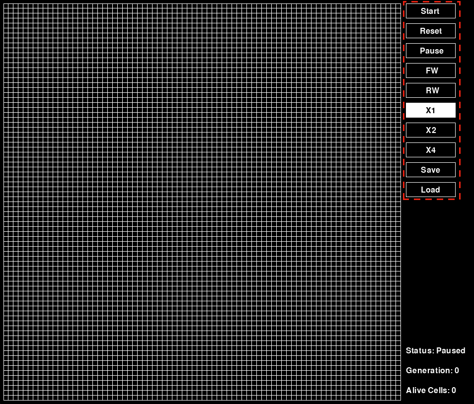

# Instructions

This document describes the controls used in the game and the effect and behaviours that are behind them when used.

### Start
Starts moving the game forward and rendering the next generations on the screen. While the game is on this mode the board cannot be edited.

### Reset
Clicking on `Reset` restarts the game and cleans all progress made.

### Pause
Pauses the game, when the game is paused the board can be edited.

### FW & RW

FW pushed the board one step further, whilest RW reverts to the previous state. When you are observing a previous state and then decide the advance to the next generation the following generation does not get calculated again as it is already calculated, which means that if changes are made in generation `A-1` (where `A >  0`) this will be lost in generation `A`.

### X1, X2 & X4

This buttons allow to set the speed in which generations are calculated and rendered.

### Save & Load

These buttons allow to save and load the game state to a binary file. The save file is named in the format of `{year}-{month}-{day}-{hour}-{minute}` and stored in the same directory as the Python code is.